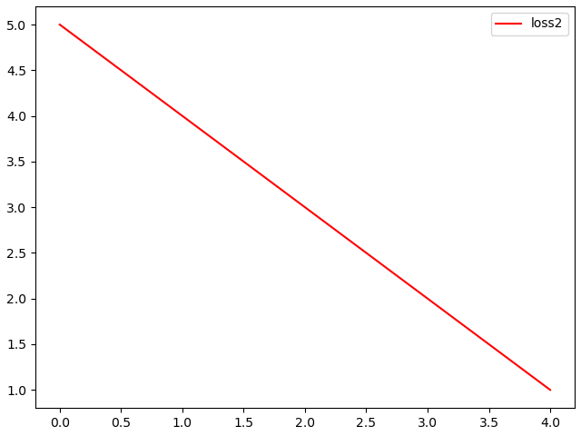

<div align='center'>

[简体中文](readme.md) | English

</div>

- [EasyLossUtil](#easylossutil)
  - [1 Introduction](#1-introduction)
  - [2 requirement](#2-requirement)
  - [3 Easy Loss Util example](#3-easy-loss-util-example)
    - [3.1 Visualing loss data with '.png' images and saveing loss data to '.csv' files](#31-visualing-loss-data-with-png-images-and-saveing-loss-data-to-csv-files)
    - [3.2 the solution for Breakpoint continuation](#32-the-solution-for-breakpoint-continuation)
  - [4 Quick Average Method Example](#4-quick-average-method-example)
  - [5 The optimized version of torchvision.utils.save\_imge](#5-the-optimized-version-of-torchvisionutilssave_imge)
  - [6 Some common utils](#6-some-common-utils)
    - [6.1 retainTail(num, n) function --- Retain the given number to the specified number of decimal places](#61-retaintailnum-n-function-----retain-the-given-number-to-the-specified-number-of-decimal-places)
    - [6.2 ParamsParent class --- Parent class of each parameter class](#62-paramsparent-class-----parent-class-of-each-parameter-class)
    - [6.3 formatSeconds(seconds, targetStr) function --- format the number of seconds](#63-formatsecondsseconds-targetstr-function-----format-the-number-of-seconds)
    - [6.4 getEqNum(pred\_vector, label) function --- calculating the accuracy in image classification](#64-geteqnumpred_vector-label-function-----calculating-the-accuracy-in-image-classification)
    - [6.5 checkDir(dir\_path) function --- if directory that the dir\_path stands for is non-existent, then we will recursively create it.](#65-checkdirdir_path-function-----if-directory-that-the-dir_path-stands-for-is-non-existent-then-we-will-recursively-create-it)
    - [6.6 get\_lr(optimizer:torch.optim.Optimizer) function --- get the current learning rate of the given optimizer](#66-get_lroptimizertorchoptimoptimizer-function-----get-the-current-learning-rate-of-the-given-optimizer)

# EasyLossUtil   
## 1 Introduction
There always are some loss data waiting for visualing and saving when we train our deep learning models.<br>
For example, we want to observe the dynamic curve of cross entropy loss value and accuracy in image classification task.<br>
However, experiment tools such as Tensorbord is too complex for me because I am impatient to configure it.<br>
As a result, I develop this simple and lightweight utils for visualing and saving loss, accuracy and so on.<br>

The app package is in the directory named 'dist' and the `installation command` is as follows:<br>

> pip install .\EasyLossUtil-0.8-py3-none-any.whl

## 2 requirement
The third packages for developing this utils:<br>
pandas==1.0.5<br>
numpy==1.21.4<br>
matplotlib==3.2.2<br>
torch>=1.11.0<br>

> Note:<br>
> - The first three packages are not necessarily consistent with those versions<br>
> - The version of torch must be high than 1.11.0<br>

## 3 Easy Loss Util example

### 3.1 Visualing loss data with '.png' images and saveing loss data to '.csv' files
```python
import os
from EasyLossUtil.easyLossUtil import EasyLossUtil

# get the absolute path of this python script
root_path = os.path.dirname(__file__)
# the name of loss
name_list = ["loss1", "loss2"]
# initialize the tool
lossUtil = EasyLossUtil(
    # set the name of loss
    loss_name_list=name_list,
    # the root directory of loss data
    loss_root_dir=os.path.join(root_path, "test_loss")
)
# the fake loss data, 5 epoch
loss1 = [1, 2, 3, 4]
loss2 = [5, 2, 3, 4]
# simulate the training procedure
total_epochs = len(loss1)
for i in range(total_epochs):
    lossUtil.append(
        loss_name=name_list,
        # the sequence of loss data must be consistent with the sequence of loss name
        # For example, the loss1 is in front of loss2 according to name list [loss1, loss2]
        # Then the data list should be [loss1, loss2]
        loss_data=[
            loss1[i],
            loss2[i]
        ]
    )
# this function will automatically save the data to images and csv files
lossUtil.autoSaveFileAndImage()
```
**There are some hint after using this tool:**   
EasyLossUtil---All the loss names:   
loss1   
loss2   

**The results:**   
loss1.png   
  
loss2.png   
  

loss1.csv:   
1   
2   
3   
4   

loss1.csv:  
5   
2   
3   
4   

### 3.2 the solution for Breakpoint continuation
Maybe we will meet the following situation:<br>
Our models have been trained 200 epochs, but the server suddenly stops our programs (power cut or crash) or we kill the process for some other reasons.<br>
Fortunately, we save the checkpoints of models in 200th epoch and all the previous loss data.<br>
And we want to train the model from 200th epoch. At the same time, we need the loss data to be contious, which means we don't discard the previous loss data.<br>

Then we can configure this util as the follows:<br>
Setting `loadArchive=True` when we init the util.<br>

When this flag is True, the utils will automatically load the previsous loss data from the directory 'loss_root_dir' to initialize itself.<br>

```python
import os
from EasyLossUtil.easyLossUtil import EasyLossUtil

# get the absolute path of this python script
root_path = os.path.dirname(__file__)  
# the name of loss
name_list = ["loss1", "loss2"]
# initialize the tool
lossUtil = EasyLossUtil(
    loss_name_list=name_list,
    loss_root_dir=os.path.join(root_path, "test_loss"),
    # the solution for Breakpoint continuation
    loadArchive=True
)
# print the loss data of the util to observe if it successfully initialize itself
# data is a dict
print(lossUtil.data)
# then we could add data to the util as the section 3.1
```

## 4 Quick Average Method Example
This util is developed for quickly computing average<br>
For example, there are many iterations in one epoch, then we can use this util to get the average of loss in this epoch.<br>
```python
from EasyLossUtil.quickAverageMethod import QuickAverageMethod

# the name of loss
name_list = ["loss1", "loss2"]
# initialize the tool
q = QuickAverageMethod(loss_name_list=name_list)
# the fake loss data in 5 iterations
loss1 = [1, 2, 3, 4, 0]
loss2 = [5, 2, 3, 4, 0]
# simulate the training procedure
for i in range(len(loss1)):
    q.append(loss_name=name_list, value=[loss1[i], loss2[i]])
# get the average of two loss
all_avg_loss = q.getAllAvgLoss()
print(all_avg_loss)
```

The output of this script:<br>
[2.0, 2.8]<br>
They are the average of loss1 and loss2 respectively.<br>

## 5 The optimized version of torchvision.utils.save_imge
I found out that torchvision.utils.save_imge cost too much storage space when saving gray images (channel=1)<br>
As a result, I optimized it following this blog:<br>
> https://blog.csdn.net/nyist_yangguang/article/details/119935122 <br>

The example for using:<br>
setting `gray_image=True`<br>
```python
from EasyLossUtil.saveTensor2Img import save_image
import torch
a = torch.randn((10, 1, 64, 128))
save_image(
    a,
    'efficient_save_tensor.png',
    gray_image=True,
    nrow=2,
    padding=5
)
```

## 6 Some common utils
### 6.1 retainTail(num, n) function --- Retain the given number to the specified number of decimal places
> The parameters and return value for this function:<br>
> - num: the given number<br>
> - n: the specified number of decimal places<br>
> - return: the result character string<br>

### 6.2 ParamsParent class --- Parent class of each parameter class
this class implements the `__repr__` function<br>
So that its child classes could be directly printd<br>

Example codes:   
```python
from EasyLossUtil.global_utils import ParamsParent

class MyParams(ParamsParent):
    my_param1 = 1
    my_param2 = 2
    
my_params = MyParams()
print(my_params)

"""
The output of this script:   
---MyParams---
my_param1: 1   
my_param2: 2   
------------------
"""
```


### 6.3 formatSeconds(seconds, targetStr) function --- format the number of seconds
format the number of seconds, those number that is bigger than 60 will be transform to minute.<br>

> The parameters and return value for this function:<br>
> - seconds: the number of seconds
> - targetStr: the hint before seconds infomation
> - return: the result character string<br>   

For example:<br>

```python
from EasyLossUtil.global_utils import formatSeconds

print(formatSeconds(120, "epoch time"))
"""
The output is:
epoch time: 2 min
"""

print(formatSeconds(32, "epoch time"))
"""
The output is:
epoch time: 32 sec
"""
```

### 6.4 getEqNum(pred_vector, label) function --- calculating the accuracy in image classification
Get the index of maximum in the prediction vector, then we regard it as the predicted label.<br>
The next, we will compare predicted label with the ground truth<br>
The last, we can get the corrent number, and we could compute the accuracy by the formula:<br>

$acc = \frac{correctNum}{totalNum}$

> The parameters and return value for this function:<br>
> - pred_vector: the ouput prediction vector of model, its shape is [Batch_size, num_categories] <br>
> - label: the ground truth of this batch smaples, its shape is [B_size], such as 1 stands for this smaple's categoty is 2th (begin with 0 in computer science)<br>
> - return: the result accuracy<br>

### 6.5 checkDir(dir_path) function --- if directory that the dir_path stands for is non-existent, then we will recursively create it.
dir_path: the directory that we want to create <br>

Example codes：<br>
```python
from EasyLossUtil.global_utils import checkDir
dir_path = "./test1/test2"
checkDir(dir_path)
# if there is not the directory 'test1', then we will create it and create 'test2' inside it.
# if there just is not 'test2' inside 'test1', then we will create 'test2'
# if all the two directory 'test1' and 'test2' are existent, this function will do nothing.
```

### 6.6 get_lr(optimizer:torch.optim.Optimizer) function --- get the current learning rate of the given optimizer
